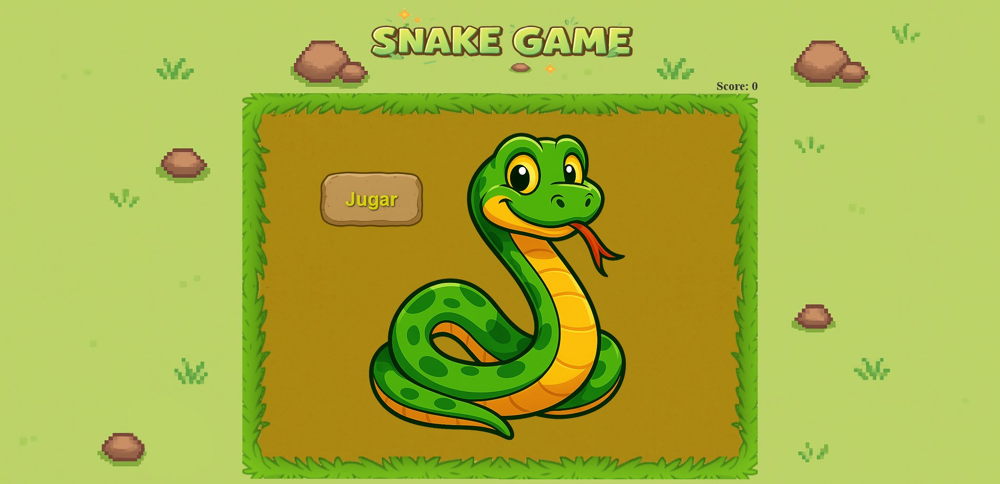
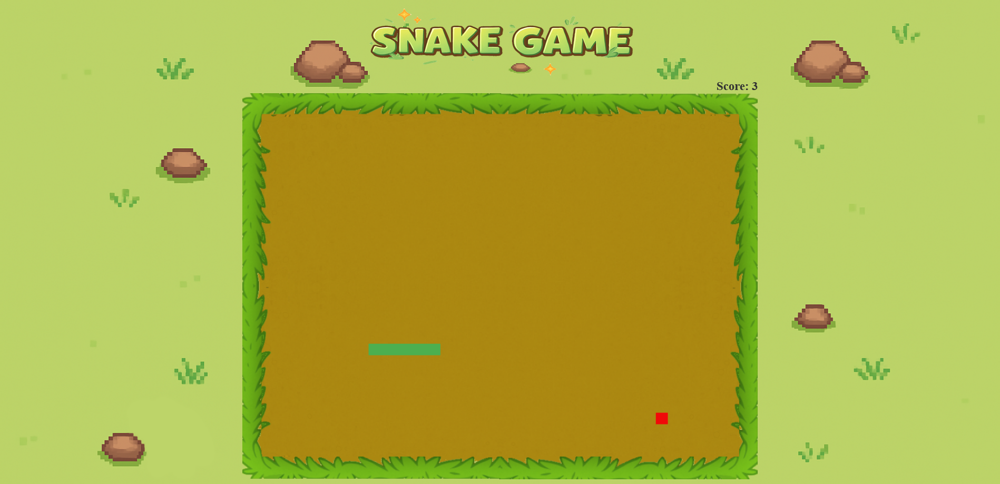

# 🐍 Snake Game

Versión web del clásico juego Snake, desarrollado con **React** y **canvas 2D**.  
El jugador controla una serpiente que debe comer para crecer, evitando colisionar consigo misma o con los bordes del escenario.

---

## 🚀 Características

- 🎮 Movimiento fluido y responsivo con teclas WASD
- 🍎 Comida aleatoria en cada partida
- 🧠 Colisión consigo mismo y con los bordes
- ⚡ Aumento de dificultad progresiva (la velocidad se incrementa al comer)
- 🪙 Puntuación en pantalla
- 🔁 Reinicio limpio del juego tras perder
- 🎨 Interfaz cuidada con imágenes, fondo y marco decorativo

---

## 📦 Tecnologías utilizadas

- [React](https://reactjs.org/)
- Canvas 2D API (HTML5)
- JavaScript
- CSS Modules

---

## 📸 Captura de pantalla




---

## 🔧 Instalación y uso

```bash
# Clona el repositorio
git clone https://github.com/tuusuario/snake-game.git
cd snake-game

# Instala las dependencias
npm install

# Inicia el servidor local
npm run dev
```

Luego abre [http://localhost:5173](http://localhost:5173) en tu navegador.

---

## 🎯 Controles

- `W` = Arriba
- `A` = Izquierda
- `S` = Abajo
- `D` = Derecha

---

## 📁 Estructura del proyecto

```
src/
│
├── assets/             → Imágenes del juego
├── components/         → GameCanvas, Menu, GameOver, Border...
├── classes/            → Lógica de Snake y Food
├── utils/              → Funciones helpers como adjustSpeed()
├── App.jsx             → Componente raíz y controlador de estado
├── main.jsx            → Entrada principal de React
└── index.css           → CSS de App.jsx
```

---

## 🧪 Próximas mejoras (planificadas)

- 🧱 Obstáculos opcionales
- 🏆 Registro de récords con `localStorage`
- 🎵 Sonidos y efectos visuales

---

## 📝 Licencia

Este proyecto es de uso libre para fines educativos o personales.

---

Desarrollado con 💚 por Daniel Campón